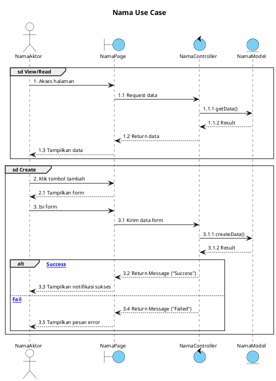

# Untuk Laporan KP - Klinik Keluarga Career

## TUJUAN
Generate sequence diagram dalam format PlantUML berdasarkan use case yang ada,
dengan style dan struktur yang konsisten untuk laporan KP.

---

## KONTEKS PROJECT
- Aplikasi: Klinik Keluarga Career (E-Recruitment)
- Framework: Laravel 11 (MVC Architecture)
- Dua aktor utama: Pelamar (Candidate) dan HRD (Admin)
- Struktur MVC: Page (View/Blade) → Controller → Model → Database

---

## ATURAN LIFELINE

Gunakan 4 lifeline standar sesuai arsitektur MVC Laravel:

```
Actor       → Aktor (Pelamar atau HRD)
Boundary    → Page/View (Blade template, contoh: "LoginPage", "VacancyPage")
Control     → Controller (contoh: "AuthController", "JobController")
Entity      → Model/Database (contoh: "CandidateModel", "JobModel")
```

Notasi PlantUML:
```plantuml
actor "Pelamar" as Pelamar
boundary "NamaPage" as Page
control "NamaController" as Controller
entity "NamaModel" as Model
```

---

## TEMPLATE DASAR



---

## ATURAN PENOMORAN PESAN

Gunakan penomoran hierarkis seperti contoh berikut:
```
1.      → Aksi utama dari aktor
1.1     → Response/request pertama dari sistem
1.1.1   → Interaksi ke layer berikutnya (Controller → Model)
1.1.2   → Return/result dari layer tersebut
1.2     → Response balik ke aktor
```

Untuk grup baru (Create, Update, Delete), lanjutkan nomor:
```
2.      → Aksi aktor untuk Create
3.      → Lanjutan aksi dalam Create (isi form, dll)
4.      → Aksi aktor untuk Update
5.      → Lanjutan aksi dalam Update
6.      → Aksi aktor untuk Delete
```

---

## ATURAN GRUP

Gunakan label grup sesuai operasi CRUD:
```plantuml
group sd View/Read
  ...
end

group sd Create
  ...
end

group sd Update
  ...
end

group sd Delete
  ...
end
```

Gunakan `alt` untuk kondisi sukses/gagal di dalam grup:
```plantuml
alt [Success]
  Controller --> Page : Return Message ("Success ...")
else [Fail]
  Controller --> Page : Return Message ("Failed ...")
end
```

---

## DAFTAR USE CASE & LIFELINE

Gunakan referensi ini saat generate diagram:

### Sisi Pelamar
| Use Case | Page | Controller | Model |
|---|---|---|---|
| Register Akun | RegisterPage | AuthController | CandidateModel |
| Login | LoginPage | AuthController | CandidateModel |
| Kelola Profil | ProfilePage | ProfileController | CandidateModel |
| Kelola Dokumen | DocumentPage | DocumentController | DocumentModel |
| Mencari Lowongan | VacancyPage | VacancyController | JobModel |
| Melamar Pekerjaan | VacancyPage | ApplicationController | ApplyModel |
| Melihat Riwayat Lamaran | ApplicationPage | ApplicationController | ApplyModel |

### Sisi HRD
| Use Case | Page | Controller | Model |
|---|---|---|---|
| Login HRD | LoginPage | AuthController | UserModel |
| Kelola Batch | BatchPage | BatchController | BatchModel |
| Kelola Kategori | CategoryPage | CategoryController | CategoryModel |
| Kelola Lowongan | JobPage | JobController | JobModel |
| Melihat Informasi Pelamar | CandidatePage | CandidateController | CandidateModel |
| Meninjau Lamaran | ApplicationPage | ApplicantController | ApplyModel |
| Menjadwalkan Wawancara | SchedulePage | ScheduleController | ScheduleModel |
| Kirim Undangan Wawancara | SchedulePage | ScheduleController | ScheduleModel |

---

## CARA PAKAI (Instruksi untuk Agent Code)

Saat diminta generate sequence diagram, lakukan langkah berikut:

1. Baca file ini (sequence-diagrams.md) terlebih dahulu
2. Identifikasi use case yang diminta
3. Tentukan lifeline yang relevan dari tabel di atas
4. Baca controller yang relevan di `app/Http/Controllers/`
5. Baca model yang relevan di `app/Models/`
6. Generate PlantUML mengikuti template dan aturan penomoran di atas
7. Simpan output ke file `{NamaUseCase}_Sequence.puml`


---

## CATATAN PENTING

- Panah solid `->` untuk request/aksi
- Panah putus `-->` untuk response/return
- Jangan tampilkan detail implementasi kode, cukup nama method
- Nama method mengikuti yang ada di Controller dan Model
- Maksimal kedalaman penomoran: 3 level (1.1.1)
- Satu file PlantUML per use case, jangan digabung kecuali CRUD dalam 1 halaman